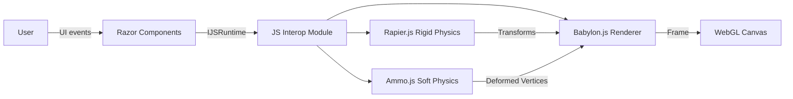
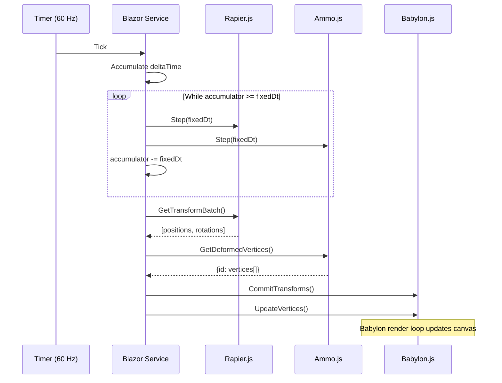
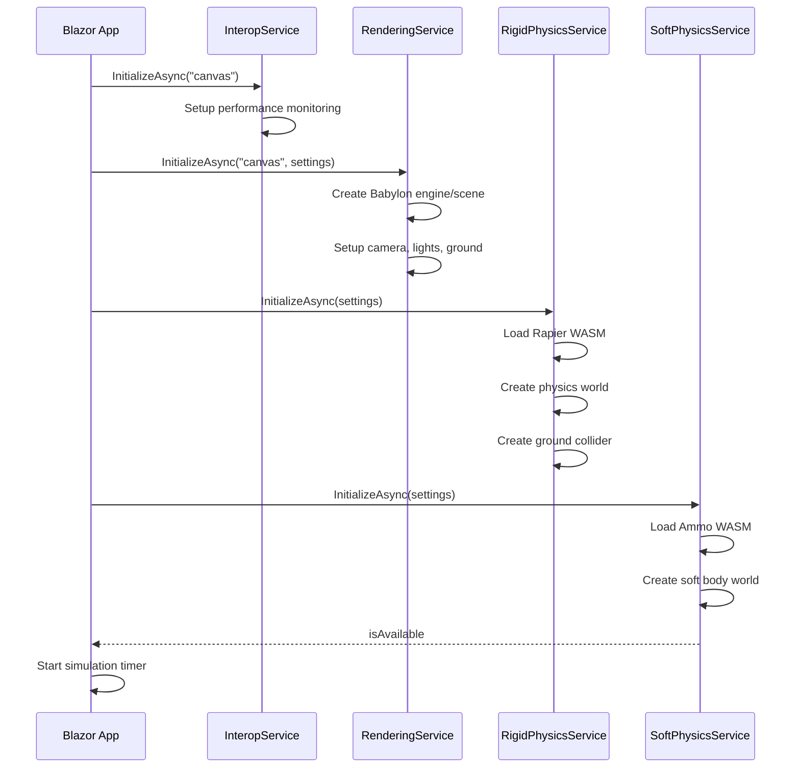

# Architecture Overview

This document describes the system architecture of the Blazor 3D Physics application.

## High-Level Architecture



## Component Architecture

### Blazor Layer (C#)

The C# layer handles:
- UI state management
- User input processing  
- Service orchestration
- Fixed-timestep physics loop

```
BlazorClient/
??? Pages/
?   ??? Index.razor          # Main page, simulation loop
??? Components/
?   ??? Viewport.razor       # Canvas host
?   ??? Toolbar.razor        # Spawn controls, playback
?   ??? Inspector.razor      # Property editing
?   ??? Stats.razor          # Performance display
??? Services/
?   ??? RenderingService.cs  # Babylon.js wrapper
?   ??? RigidPhysicsService.cs # Rapier wrapper
?   ??? SoftPhysicsService.cs  # Ammo wrapper
?   ??? InteropService.cs    # Batched JS calls
?   ??? SceneStateService.cs # Central state
??? Models/
    ??? PhysicsTypes.cs      # Value types, materials
    ??? SceneObjects.cs      # Entity definitions
```

### JavaScript Layer

The JS layer handles:
- WebGL rendering via Babylon.js
- Physics simulation via Rapier/Ammo WASM
- Low-level browser interaction

```
wwwroot/js/
??? rendering.js       # Babylon.js scene, materials, meshes
??? physics.rigid.js   # Rapier world, bodies, colliders
??? physics.soft.js    # Ammo soft body world
??? interop.js         # Bridge, batching, performance
```

## Data Flow

### Simulation Loop



### Fixed Timestep Accumulator

The physics loop uses a fixed timestep with an accumulator to ensure deterministic simulation:

```csharp
float accumulator = 0;
const float fixedDt = 1f / 120f;

void Update(float deltaTime)
{
    accumulator += deltaTime * timeScale;
    
    while (accumulator >= fixedDt)
    {
        PhysicsStep(fixedDt);
        accumulator -= fixedDt;
    }
    
    // Optional: interpolate for rendering
    float alpha = accumulator / fixedDt;
}
```

## Service Interfaces

### IRenderingService

```csharp
public interface IRenderingService
{
    Task InitializeAsync(string canvasId, RenderSettings settings);
    Task CreateRigidMeshAsync(RigidBody body);
    Task CreateSoftMeshAsync(SoftBody body);
    Task UpdateMeshTransformAsync(string id, TransformData transform);
    Task UpdateSoftMeshVerticesAsync(string id, float[] vertices, float[]? normals);
    Task RemoveMeshAsync(string id);
    Task SetSelectionAsync(string? id);
}
```

### IRigidPhysicsService

```csharp
public interface IRigidPhysicsService
{
    Task InitializeAsync(SimulationSettings settings);
    Task CreateRigidBodyAsync(RigidBody body);
    Task RemoveRigidBodyAsync(string id);
    Task UpdateRigidBodyAsync(RigidBody body);
    Task StepAsync(float deltaTime);
    Task<RigidTransformBatch> GetTransformBatchAsync();
    Task ResetAsync();
}
```

### ISoftPhysicsService

```csharp
public interface ISoftPhysicsService
{
    Task InitializeAsync(SimulationSettings settings);
    Task CreateClothAsync(SoftBody body);
    Task CreateRopeAsync(SoftBody body);
    Task CreateVolumetricAsync(SoftBody body);
    Task PinVertexAsync(string id, int vertexIndex, Vector3 position);
    Task UnpinVertexAsync(string id, int vertexIndex);
    Task StepAsync(float deltaTime);
    Task<Dictionary<string, SoftBodyVertexData>> GetDeformedVerticesAsync();
    Task<bool> IsAvailableAsync();
}
```

## Interop Batching Strategy

To minimize JS interop overhead, we batch updates:

### Transform Batching
```javascript
// Single interop call with typed array
function updateRigidTransforms(transforms, ids) {
    // transforms: Float32Array [px,py,pz,rx,ry,rz,rw, ...]
    // ids: string[]
    const stride = 7;
    for (let i = 0; i < ids.length; i++) {
        updateMesh(ids[i], transforms.subarray(i*stride, (i+1)*stride));
    }
}
```

### Vertex Double-Buffering
For soft bodies, we double-buffer vertex data to avoid allocation:

```csharp
private readonly Dictionary<string, float[]> _bufferA = new();
private readonly Dictionary<string, float[]> _bufferB = new();
private bool _useBufferA = true;

async Task CommitSoftVerticesAsync(string id, float[] vertices)
{
    var buffer = _useBufferA ? _bufferA : _bufferB;
    if (!buffer.TryGetValue(id, out var arr) || arr.Length != vertices.Length)
    {
        buffer[id] = new float[vertices.Length];
    }
    Array.Copy(vertices, buffer[id], vertices.Length);
    await _jsRuntime.InvokeVoidAsync("updateVertices", id, buffer[id]);
}
```

## State Management

### SceneStateService

Central state management with change notifications:

```csharp
public class SceneStateService
{
    private readonly List<RigidBody> _rigidBodies = new();
    private readonly List<SoftBody> _softBodies = new();
    
    public event Action? OnStateChanged;
    
    public IReadOnlyList<RigidBody> RigidBodies => _rigidBodies;
    public IReadOnlyList<SoftBody> SoftBodies => _softBodies;
    
    public void AddRigidBody(RigidBody body)
    {
        _rigidBodies.Add(body);
        OnStateChanged?.Invoke();
    }
}
```

## Initialization Sequence



## Error Handling

### Fallback Strategy

If soft body physics fails to initialize:
1. `SoftPhysicsService.IsAvailableAsync()` returns `false`
2. UI disables soft body spawn buttons
3. Warning indicator shown to user
4. Rigid body physics continues normally

### Graceful Degradation

```csharp
public async Task InitializeSoftPhysicsAsync()
{
    try
    {
        await SoftPhysics.InitializeAsync(Settings);
        _softBodyAvailable = await SoftPhysics.IsAvailableAsync();
    }
    catch (Exception ex)
    {
        Console.Error.WriteLine($"Soft physics unavailable: {ex.Message}");
        _softBodyAvailable = false;
    }
}
```

## Thread Safety

Blazor WASM is single-threaded, but we use async patterns:
- Timer callbacks are marshaled to UI thread
- `InvokeAsync` ensures UI updates on correct context
- No explicit locking needed in WASM environment

## Memory Management

- Object pooling for frequently allocated types
- Reuse typed arrays for batched transfers
- Dispose pattern for JS module references
- Manual cleanup of physics bodies on removal
