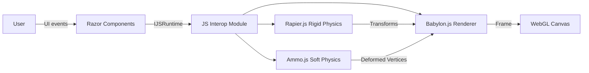

# Architecture Overview

This document describes the system architecture of the Blazor 3D Physics application.

## SOLID Principles Compliance

This codebase follows all five SOLID principles:

| Principle | Implementation |
|-----------|----------------|
| **S**ingle Responsibility | `SimulationLoopService` handles only simulation timing; `Index.razor` handles only UI |
| **O**pen/Closed | Mesh and material creation uses registry pattern - extend without modification |
| **L**iskov Substitution | All physics services implement `IPhysicsService` base interface |
| **I**nterface Segregation | Soft body interfaces split: `IClothPhysicsService`, `IRopePhysicsService`, etc. |
| **D**ependency Inversion | All components depend on abstractions (interfaces), not concrete implementations |

## High-Level Architecture



## Component Architecture

### Blazor Layer (C#)

The C# layer handles:
- UI state management
- User input processing  
- Service orchestration
- Fixed-timestep physics loop

```
BlazorClient/
??? Pages/
?   ??? Index.razor              # Main page, UI coordination only (SRP)
??? Components/
?   ??? Viewport.razor           # Canvas host
?   ??? Toolbar.razor            # Spawn controls, playback
?   ??? Inspector.razor          # Property editing
?   ??? Stats.razor              # Performance display
??? Services/
?   ??? Interfaces/
?   ?   ??? IPhysicsInterfaces.cs # Segregated physics interfaces (ISP)
?   ??? Factories/
?   ?   ??? MeshCreatorFactory.cs    # Extensible mesh creation (OCP)
?   ?   ??? MaterialCreatorFactory.cs # Extensible material creation (OCP)
?   ??? SimulationLoopService.cs  # Physics loop timing only (SRP)
?   ??? RenderingService.cs       # Babylon.js wrapper
?   ??? PhysicsService.Rigid.cs   # Rapier wrapper (implements IPhysicsService)
?   ??? PhysicsService.Soft.cs    # Ammo wrapper (implements segregated interfaces)
?   ??? InteropService.cs         # Batched JS calls
?   ??? SceneStateService.cs      # Central state
??? Models/
    ??? PhysicsTypes.cs           # Value types, materials
    ??? SceneObjects.cs           # Entity definitions
```

### JavaScript Layer

The JS layer handles:
- WebGL rendering via Babylon.js
- Physics simulation via Rapier/Ammo WASM
- Low-level browser interaction

```
wwwroot/js/
??? rendering.js       # Babylon.js scene with registry pattern (OCP)
??? physics.rigid.js   # Rapier world, bodies, colliders
??? physics.soft.js    # Ammo soft body world
??? interop.js         # Bridge with dependency injection (DIP)
```

## Service Interfaces (SOLID Compliant)

### Base Physics Interface (LSP)

All physics services implement this base interface, enabling uniform treatment:

```csharp
public interface IPhysicsService
{
    Task<bool> IsAvailableAsync();
    Task StepAsync(float deltaTime);
    Task UpdateSettingsAsync(SimulationSettings settings);
    Task ResetAsync();
    ValueTask DisposeAsync();
}
```

### Segregated Soft Body Interfaces (ISP)

Clients depend only on the interfaces they need:

```csharp
public interface IClothPhysicsService
{
    Task CreateClothAsync(SoftBody body);
}

public interface IRopePhysicsService
{
    Task CreateRopeAsync(SoftBody body);
}

public interface IVolumetricPhysicsService
{
    Task CreateVolumetricAsync(SoftBody body);
}

public interface IVertexPinningService
{
    Task PinVertexAsync(string id, int vertexIndex, Vector3 worldPosition);
    Task UnpinVertexAsync(string id, int vertexIndex);
}

public interface ISoftBodyVertexDataService
{
    Task<Dictionary<string, SoftBodyVertexData>> GetDeformedVerticesAsync();
    Task<SoftBodyVertexData> GetDeformedVerticesAsync(string id);
}
```

### Simulation Loop Service (SRP)

Extracted from Index.razor to handle only simulation timing:

```csharp
public interface ISimulationLoopService : IAsyncDisposable
{
    event Action? OnSimulationStateChanged;
    float Fps { get; }
    float PhysicsTimeMs { get; }
    bool IsRunning { get; }
    
    Task StartAsync();
    Task StopAsync();
    Task StepOnceAsync();
}
```

## Factory Pattern (OCP)

### Mesh Creator Factory

Extensible mesh creation without modifying existing code:

```csharp
public interface IMeshCreator
{
    RigidPrimitiveType PrimitiveType { get; }
    object GetMeshOptions(RigidBody body);
}

public interface IMeshCreatorFactory
{
    IMeshCreator GetCreator(RigidPrimitiveType primitiveType);
    void RegisterCreator(IMeshCreator creator); // Extend without modification
}
```

### JavaScript Registry Pattern

```javascript
// OCP - Add new mesh types without modifying createRigidMesh
const meshCreators = {
    sphere: (id, scene, options) => BABYLON.MeshBuilder.CreateSphere(id, options, scene),
    box: (id, scene, options) => BABYLON.MeshBuilder.CreateBox(id, options, scene),
    // Add new types here without modifying createRigidMesh function
};

// Register custom creators at runtime
RenderingModule.registerMeshCreator('custom', myCustomCreator);
```

## Data Flow

### Simulation Loop

```mermaid
sequenceDiagram
    participant Timer as Timer (60 Hz)
    participant Loop as SimulationLoopService
    participant Rigid as IRigidPhysicsService
    participant Soft as ISoftPhysicsService
    participant Interop as IInteropService

    Timer->>Loop: Tick
    Loop->>Loop: Accumulate deltaTime
    
    loop While accumulator >= fixedDt
        Loop->>Rigid: StepAsync(fixedDt)
        Loop->>Soft: StepAsync(fixedDt)
        Loop->>Loop: accumulator -= fixedDt
    end
    
    Loop->>Rigid: GetTransformBatchAsync()
    Rigid-->>Loop: RigidTransformBatch
    
    Loop->>Soft: GetDeformedVerticesAsync()
    Soft-->>Loop: Dictionary<string, SoftBodyVertexData>
    
    Loop->>Interop: CommitRigidTransformsAsync()
    Loop->>Interop: CommitSoftVerticesAsync()
    
    Loop->>Loop: OnSimulationStateChanged?.Invoke()
```

### Fixed Timestep Accumulator

The physics loop uses a fixed timestep with an accumulator to ensure deterministic simulation:

```csharp
float accumulator = 0;
const float fixedDt = 1f / 120f;

void Update(float deltaTime)
{
    accumulator += deltaTime * timeScale;
    
    while (accumulator >= fixedDt)
    {
        PhysicsStep(fixedDt);
        accumulator -= fixedDt;
    }
    
    // Optional: interpolate for rendering
    float alpha = accumulator / fixedDt;
}
```

## Dependency Injection Setup

All services are registered with proper abstractions (DIP):

```csharp
// Core services
builder.Services.AddScoped<IRenderingService, RenderingService>();
builder.Services.AddScoped<IRigidPhysicsService, RigidPhysicsService>();
builder.Services.AddScoped<ISoftPhysicsService, SoftPhysicsService>();
builder.Services.AddScoped<IInteropService, InteropService>();
builder.Services.AddScoped<ISceneStateService, SceneStateService>();

// Simulation loop (SRP)
builder.Services.AddScoped<ISimulationLoopService, SimulationLoopService>();

// Factories (OCP)
builder.Services.AddSingleton<IMeshCreatorFactory, MeshCreatorFactory>();
builder.Services.AddSingleton<IMaterialCreatorFactory, MaterialCreatorFactory>();

// Segregated interfaces (ISP) - same implementation, different interfaces
builder.Services.AddScoped<IClothPhysicsService>(sp => sp.GetRequiredService<ISoftPhysicsService>());
builder.Services.AddScoped<IRopePhysicsService>(sp => sp.GetRequiredService<ISoftPhysicsService>());
builder.Services.AddScoped<IVolumetricPhysicsService>(sp => sp.GetRequiredService<ISoftPhysicsService>());
```

## Interop Batching Strategy

To minimize JS interop overhead, we batch updates:

### Transform Batching
```javascript
// Single interop call with typed array
function updateRigidTransforms(transforms, ids) {
    // transforms: Float32Array [px,py,pz,rx,ry,rz,rw, ...]
    // ids: string[]
    const stride = 7;
    for (let i = 0; i < ids.length; i++) {
        updateMesh(ids[i], transforms.subarray(i*stride, (i+1)*stride));
    }
}
```

### Vertex Double-Buffering
For soft bodies, we double-buffer vertex data to avoid allocation:

```csharp
private readonly Dictionary<string, float[]> _bufferA = new();
private readonly Dictionary<string, float[]> _bufferB = new();
private bool _useBufferA = true;

async Task CommitSoftVerticesAsync(string id, float[] vertices)
{
    var buffer = _useBufferA ? _bufferA : _bufferB;
    if (!buffer.TryGetValue(id, out var arr) || arr.Length != vertices.Length)
    {
        buffer[id] = new float[vertices.Length];
    }
    Array.Copy(vertices, buffer[id], vertices.Length);
    await _jsRuntime.InvokeVoidAsync("updateVertices", id, buffer[id]);
}
```

## State Management

### SceneStateService

Central state management with change notifications:

```csharp
public class SceneStateService
{
    private readonly List<RigidBody> _rigidBodies = new();
    private readonly List<SoftBody> _softBodies = new();
    
    public event Action? OnStateChanged;
    
    public IReadOnlyList<RigidBody> RigidBodies => _rigidBodies;
    public IReadOnlyList<SoftBody> SoftBodies => _softBodies;
    
    public void AddRigidBody(RigidBody body)
    {
        _rigidBodies.Add(body);
        OnStateChanged?.Invoke();
    }
}
```

## Initialization Sequence

```mermaid
sequenceDiagram
    participant App as Index.razor
    participant Int as IInteropService
    participant Rnd as IRenderingService
    participant Rig as IRigidPhysicsService
    participant Sft as ISoftPhysicsService
    participant Loop as ISimulationLoopService

    App->>Int: InitializeAsync("canvas")
    Int->>Int: Setup performance monitoring
    
    App->>Rnd: InitializeAsync("canvas", settings)
    Rnd->>Rnd: Create Babylon engine/scene
    Rnd->>Rnd: Setup camera, lights, ground
    
    App->>Rig: InitializeAsync(settings)
    Rig->>Rig: Load Rapier WASM
    Rig->>Rig: Create physics world
    Rig->>Rig: Create ground collider
    
    App->>Sft: InitializeAsync(settings)
    Sft->>Sft: Load Ammo WASM
    Sft->>Sft: Create soft body world
    Sft-->>App: isAvailable
    
    App->>Loop: StartAsync()
    Loop->>Loop: Start PeriodicTimer
```

## Error Handling

### Fallback Strategy

If soft body physics fails to initialize:
1. `SoftPhysicsService.IsAvailableAsync()` returns `false`
2. UI disables soft body spawn buttons
3. Warning indicator shown to user
4. Rigid body physics continues normally

### Graceful Degradation

```csharp
public async Task InitializeSoftPhysicsAsync()
{
    try
    {
        await SoftPhysics.InitializeAsync(Settings);
        _softBodyAvailable = await SoftPhysics.IsAvailableAsync();
    }
    catch (Exception ex)
    {
        Console.Error.WriteLine($"Soft physics unavailable: {ex.Message}");
        _softBodyAvailable = false;
    }
}
```

## Thread Safety

Blazor WASM is single-threaded, but we use async patterns:
- Timer callbacks are marshaled to UI thread
- `InvokeAsync` ensures UI updates on correct context
- No explicit locking needed in WASM environment

## Memory Management

- Object pooling for frequently allocated types
- Reuse typed arrays for batched transfers
- Dispose pattern for JS module references
- Manual cleanup of physics bodies on removal
