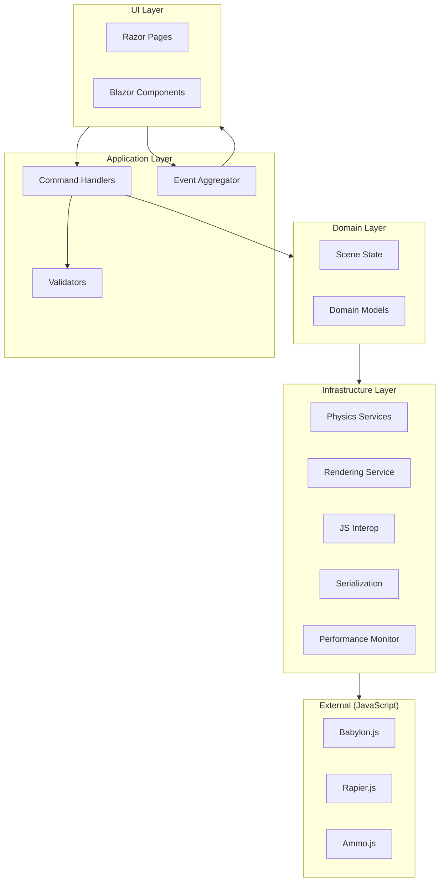

# Architecture Overview

This document describes the system architecture of the Blazor 3D Physics application.

## SOLID Principles Compliance

This codebase follows all five SOLID principles:

| Principle | Implementation |
|-----------|----------------|
| **S**ingle Responsibility | `SimulationLoopService` handles only simulation timing; `Index.razor` handles only UI |
| **O**pen/Closed | Mesh and material creation uses registry pattern - extend without modification |
| **L**iskov Substitution | All physics services implement `IPhysicsService` base interface |
| **I**nterface Segregation | Soft body interfaces split: `IClothPhysicsService`, `IRopePhysicsService`, etc. |
| **D**ependency Inversion | All components depend on abstractions (interfaces), not concrete implementations |

## Architectural Patterns

| Pattern | Implementation | Purpose |
|---------|----------------|---------|
| **CQRS-Lite** | `ICommandDispatcher`, Command Handlers | Separates commands from queries |
| **Event Aggregator** | `IEventAggregator` | Decoupled component communication |
| **Result Pattern** | `Result<T>`, `Result` | Functional error handling |
| **Object Pooling** | `ArrayPool<T>`, `ObjectPool<T>` | Reduces allocations in hot paths |
| **Factory Pattern** | `IMeshCreatorFactory`, `IMaterialCreatorFactory` | Extensible object creation |

## High-Level Architecture



## Component Architecture

### Blazor Layer (C#)

```
BlazorClient/
??? Pages/
?   ??? Index.razor              # Main page, UI coordination only (SRP)
??? Components/
?   ??? Viewport.razor           # Canvas host
?   ??? Toolbar.razor            # Spawn controls, playback
?   ??? Inspector.razor          # Property editing
?   ??? Stats.razor              # Performance display
??? Services/
?   ??? Interfaces/
?   ?   ??? IPhysicsInterfaces.cs # Segregated physics interfaces (ISP)
?   ??? Factories/
?   ?   ??? MeshCreatorFactory.cs    # Extensible mesh creation (OCP)
?   ?   ??? MaterialCreatorFactory.cs # Extensible material creation (OCP)
?   ??? Commands/
?   ?   ??? CommandInterfaces.cs     # Command/Query definitions
?   ?   ??? CommandHandlers.cs       # Command handler implementations
?   ??? Events/
?   ?   ??? EventAggregator.cs       # Pub/sub event system
?   ??? Validation/
?   ?   ??? PhysicsValidator.cs      # Physics parameter validation
?   ??? SimulationLoopService.cs  # Physics loop timing only (SRP)
?   ??? RenderingService.cs       # Babylon.js wrapper
?   ??? PhysicsService.Rigid.cs   # Rapier wrapper (implements IPhysicsService)
?   ??? PhysicsService.Soft.cs    # Ammo wrapper (implements segregated interfaces)
?   ??? InteropService.cs         # Batched JS calls
?   ??? SceneStateService.cs      # Central state
?   ??? SceneSerializationService.cs # Scene import/export
?   ??? PerformanceMonitor.cs     # Performance tracking
?   ??? ObjectPool.cs             # Array/object pooling
?   ??? JsModuleCache.cs          # JS module caching
??? Models/
    ??? PhysicsTypes.cs           # Value types, materials
    ??? SceneObjects.cs           # Entity definitions
    ??? Result.cs                 # Result pattern types
```

### JavaScript Layer

```
wwwroot/js/
??? rendering.js       # Babylon.js scene with registry pattern (OCP)
??? physics.rigid.js   # Rapier world, bodies, colliders
??? physics.soft.js    # Ammo soft body world
??? interop.js         # Bridge with dependency injection (DIP)
```

## Command Pattern (CQRS-Lite)

### Command Flow


### Available Commands

| Command | Handler | Description |
|---------|---------|-------------|
| `SpawnRigidBodyCommand` | `SpawnRigidBodyCommandHandler` | Creates a rigid body |
| `SpawnSoftBodyCommand` | `SpawnSoftBodyCommandHandler` | Creates a soft body |
| `DeleteObjectCommand` | `DeleteObjectCommandHandler` | Deletes an object |
| `ResetSceneCommand` | `ResetSceneCommandHandler` | Clears the scene |
| `SelectObjectCommand` | `SelectObjectCommandHandler` | Selects an object |
| `ApplyImpulseCommand` | `ApplyImpulseCommandHandler` | Applies force to body |
| `UpdateSimulationSettingsCommand` | Handler | Updates physics settings |
| `UpdateRenderSettingsCommand` | Handler | Updates render settings |

## Event Aggregator

### Domain Events

| Event | Published When |
|-------|----------------|
| `ObjectSpawnedEvent` | Object created |
| `ObjectDeletedEvent` | Object deleted |
| `ObjectSelectedEvent` | Selection changed |
| `SimulationPausedEvent` | Play/pause toggled |
| `SimulationSettingsChangedEvent` | Settings updated |
| `RenderSettingsChangedEvent` | Render settings updated |
| `PhysicsSteppedEvent` | After each physics step |
| `SceneResetEvent` | Scene cleared |
| `SceneLoadedEvent` | Scene imported |
| `ErrorOccurredEvent` | Error detected |

### Usage Example

```csharp
// Subscribe to events
_subscription = _events.Subscribe<ObjectSpawnedEvent>(e => 
{
    Console.WriteLine($"Object spawned: {e.Name}");
});

// Publish events
_events.Publish(new ObjectSpawnedEvent(body.Id, body.Name, "Sphere"));

// Unsubscribe
_subscription.Dispose();
```

## Result Pattern

Functional error handling without exceptions:

```csharp
// Command returns Result<T>
var result = await _dispatcher.DispatchAsync<SpawnRigidBodyCommand, string>(command);

// Pattern matching
result.Match(
    onSuccess: id => Console.WriteLine($"Created: {id}"),
    onFailure: error => Console.WriteLine($"Failed: {error}")
);

// Chaining
result
    .OnSuccess(id => UpdateUI(id))
    .OnFailure(error => ShowError(error));

// Implicit bool conversion
if (result)
{
    // Success path
}
```

## Performance Optimization

### Object Pooling

```csharp
// Rent array from pool
var array = _transformPool.Rent(1024);
try
{
    // Use array
    ProcessTransforms(array);
}
finally
{
    // Return to pool
    _transformPool.Return(array);
}

// Or use disposable pattern
using var pooled = _transformPool.RentDisposable(1024);
ProcessTransforms(pooled.Array);
```

### Performance Monitor

```csharp
// Record timing manually
_monitor.RecordTiming("Physics", elapsedMs);

// Or use automatic measurement
using (_monitor.MeasureTiming("Render"))
{
    await RenderFrame();
}

// Get snapshot
var stats = _monitor.GetSnapshot();
Console.WriteLine($"FPS: {stats.Fps}, Physics: {stats.PhysicsTimeMs}ms");
```

### JS Module Cache

```csharp
// Get cached module reference
var module = await _moduleCache.GetModuleAsync("./js/physics.rigid.js");
await module.InvokeVoidAsync("step", deltaTime);

// Preload modules
await _moduleCache.PreloadModulesAsync(
    "./js/rendering.js",
    "./js/physics.rigid.js",
    "./js/physics.soft.js"
);
```

## Validation

### Physics Parameter Validation

```csharp
var validator = serviceProvider.GetService<IPhysicsValidator>();

var result = validator.ValidateRigidBody(body);
if (!result.IsValid)
{
    foreach (var error in result.Errors)
        Console.WriteLine($"Error: {error}");
}

foreach (var warning in result.Warnings)
    Console.WriteLine($"Warning: {warning}");
```

### Validated Parameters

- Mass ranges and ratios
- Scale limits
- Restitution bounds
- Damping values
- Velocity limits
- Soft body resolution
- Stiffness vs iterations
- Pressure settings

## Scene Serialization

### Save/Load Operations

```csharp
// Save to local storage
await _serialization.SaveToLocalStorageAsync("MyScene");

// Load from local storage
var result = await _serialization.LoadFromLocalStorageAsync("MyScene");
result.OnSuccess(preset => _sceneState.LoadPreset(preset));

// Export to JSON
var json = await _serialization.ExportToJsonAsync();

// Download as file
await _serialization.DownloadSceneAsync("scene.json");

// List saved scenes
var scenes = await _serialization.GetSavedScenesAsync();
```

## Service Interfaces (SOLID Compliant)

### Base Physics Interface (LSP)

```csharp
public interface IPhysicsService
{
    Task<bool> IsAvailableAsync();
    Task StepAsync(float deltaTime);
    Task UpdateSettingsAsync(SimulationSettings settings);
    Task ResetAsync();
    ValueTask DisposeAsync();
}
```

### Segregated Soft Body Interfaces (ISP)

```csharp
public interface IClothPhysicsService
{
    Task CreateClothAsync(SoftBody body);
}

public interface IRopePhysicsService
{
    Task CreateRopeAsync(SoftBody body);
}

public interface IVolumetricPhysicsService
{
    Task CreateVolumetricAsync(SoftBody body);
}

public interface IVertexPinningService
{
    Task PinVertexAsync(string id, int vertexIndex, Vector3 worldPosition);
    Task UnpinVertexAsync(string id, int vertexIndex);
}
```

## Dependency Injection Setup

```csharp
// Core services
builder.Services.AddScoped<IRenderingService, RenderingService>();
builder.Services.AddScoped<IRigidPhysicsService, RigidPhysicsService>();
builder.Services.AddScoped<ISoftPhysicsService, SoftPhysicsService>();
builder.Services.AddScoped<ISceneStateService, SceneStateService>();

// Event Aggregator (singleton for cross-component events)
builder.Services.AddSingleton<IEventAggregator, EventAggregator>();

// Command Dispatcher
builder.Services.AddScoped<ICommandDispatcher, CommandDispatcher>();

// Command Handlers
builder.Services.AddScoped<ICommandHandler<SpawnRigidBodyCommand, string>, SpawnRigidBodyCommandHandler>();
// ... other handlers

// Performance & Pooling
builder.Services.AddSingleton<IPerformanceMonitor, PerformanceMonitor>();
builder.Services.AddSingleton<ArrayPool<float>>();

// Validation
builder.Services.AddSingleton<IPhysicsValidator, PhysicsValidator>();

// Serialization
builder.Services.AddScoped<ISceneSerializationService, SceneSerializationService>();

// JS Optimization
builder.Services.AddScoped<IJsModuleCache, JsModuleCache>();
```

## Data Flow

### Simulation Loop

```mermaid
sequenceDiagram
    participant Timer as Timer (60 Hz)
    participant Loop as SimulationLoopService
    participant Monitor as PerformanceMonitor
    participant Rigid as IRigidPhysicsService
    participant Soft as ISoftPhysicsService
    participant Events as IEventAggregator

    Timer->>Loop: Tick
    Loop->>Monitor: MeasureTiming("Frame")
    Loop->>Loop: Accumulate deltaTime
    
    loop While accumulator >= fixedDt
        Loop->>Monitor: MeasureTiming("Physics")
        Loop->>Rigid: StepAsync(fixedDt)
        Loop->>Soft: StepAsync(fixedDt)
        Loop->>Loop: accumulator -= fixedDt
    end
    
    Loop->>Monitor: MeasureTiming("Interop")
    Loop->>Rigid: GetTransformBatchAsync()
    Loop->>Soft: GetDeformedVerticesAsync()
    
    Loop->>Events: Publish(PhysicsSteppedEvent)
    Loop->>Loop: OnSimulationStateChanged()
```

## Error Handling

### Result-Based Error Handling

```csharp
var result = await _dispatcher.DispatchAsync<SpawnRigidBodyCommand, string>(command);

if (result.IsFailure)
{
    _events.Publish(new ErrorOccurredEvent(
        "Failed to spawn object",
        result.Error,
        ErrorSeverity.Warning));
}
```

### Graceful Degradation

```csharp
try
{
    await SoftPhysics.InitializeAsync(Settings);
    _softBodyAvailable = await SoftPhysics.IsAvailableAsync();
}
catch (Exception ex)
{
    _events.Publish(new ErrorOccurredEvent(
        "Soft physics unavailable",
        ex.Message,
        ErrorSeverity.Warning));
    _softBodyAvailable = false;
}
```

## Memory Management

- **Object Pooling**: `ArrayPool<float>` for transform arrays
- **Result Pattern**: Stack-allocated structs avoid heap allocation
- **Circular Buffers**: Performance monitor uses fixed-size buffers
- **Dispose Pattern**: All services implement `IAsyncDisposable`
- **Event Cleanup**: Subscriptions are disposable for automatic cleanup
